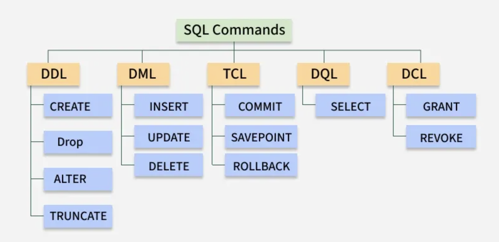

# 섹션 3. 테이블 만들기

## 워크벤치로 스키마, 테이블 만들기

- 나는 DataGrip을 사용함

- DDL: Data Definition Language

  - 데이터를 정의하는 언어
  - 데이터베이스 > 스키마 > 테이블
  - MySQL은 데이터베이스 == 스키마

- 테이블 만들때 '외래키'가 있는 테이블을 나중에 만드는 것이 좋다

- DB테이블명에 띄어쓰기 대신 언더바(\_) 사용 또는 카멜표기법 사용

  - 일반적으로 언더바(\_) 많이 사용

- MySQL DB엔진 중 대표적으로 InnoDB, MyISAM이 있음
  - InnoDB가 더 많이 쓰임

## 컬럼의 자료형과 옵션들

### 컬럼 데이터 타입

- INT: 정수
- VARCHAR(길이): 가변 길이 문자열
- DATE: 날짜
- DATETIME: 날짜 + 시간
- CHAR(길이): 고정 길이 문자열
- TEXT: 긴 문자열 - 설명, 이력서, 자기소개서 등
- BOOLEAN: true/false (1/0)
- TINYINT(1): 0, 1

### 컬럼 옵션

- NOT NULL: 무조건 값이 있어야 함
- UNIQUE: 중복된 값이 있으면 안됨
- PRIMARY KEY: 기본키, 테이블에서 유일하게 값을 가지는 컬럼
- DEFAULT: 기본값 - 값을 넣지 않으면 기본값으로 설정됨
- ZEROFILL: 빈자리를 0으로 채움
- UNSIGNED: 음수 불가, 양수만 가능(대신 양수 범위가 더 커짐)
- AUTO_INCREMENT: 자동으로 1씩 증가하는 숫자
  - 나중에 문제가 생길 수 있음
- COMMENT: 주석

## 처음 만나는 DDL

```sql
create table role
(
    id         int auto_increment
        primary key,
    name       varchar(50) not null,
    min_salary int         not null
);
```

```sql
create table employee
(
    id         int auto_increment
        primary key,
    name       varchar(50)                        not null,
    email      varchar(100)                       not null,
    salary     int                                not null,
    team       varchar(20)                        not null,
    quit_date  datetime                           null,
    created_at datetime default CURRENT_TIMESTAMP null,
    role_id    int                                not null,
    constraint id
        unique (id, email, role_id),
    constraint employee_role_fk
        foreign key (role_id) references role (id)
);
```

## on update, on delete

- foreign key options
  - on update, on delete
    - 기본값: no action (restrict과 같음)
    - cascade: 부모테이블의 값이 바뀌면 자식테이블의 값도 바뀜(on update에서 주로 사용)
    - set null: 부모테이블의 값이 바뀌면 자식테이블의 값은 null이 됨(on delete에서 주로 사용)

## 첫 데이터 넣어보기(INSERT INTO)



- DDL: Data Definition Language
  - CREATE, ALTER, DROP
- DML: Data Manipulation Language
  - INSERT, UPDATE, DELETE
- DQL: Data Query Language
  - SELECT
- TCL: Transaction Control Language
  - COMMIT, ROLLBACK
- DCL: Data Control Language
  - GRANT, REVOKE

```sql
INSERT INTO zerocho.`employee` (`name`, email, salary, team, role_id) VALUES ('투초', 'twocho@gmail.com', '8000', '기획팀', '1');

INSERT INTO zerocho.`employee` (`name`, email, salary, team, role_id) VALUES ('쓰리초', 'threecho@gmail.com', '7000', '기획팀', '2');

INSERT INTO zerocho.`employee` (`name`, email, salary, team, role_id) VALUES ('포초', 'fourcho@gmail.com', '9000', '개발팀', '2');

INSERT INTO zerocho.`employee` (`name`, email, salary, team, role_id) VALUES ('파이브초', 'fivecho@gmail.com', '6000', '기획팀', '3');

INSERT INTO zerocho.`employee` (`name`, email, salary, team, role_id) VALUES ('식스초', 'sixcho@gmail.com', '6000', '개발팀', '3');

INSERT INTO zerocho.`employee` (`name`, email, salary, team, role_id) VALUES ('세븐초', 'sevencho@gmail.com', '5000', '개발팀', '4');

INSERT INTO zerocho.`employee` (`name`, email, salary, team, role_id) VALUES ('에잇초', 'eightcho@gmail.com', '4000', '디자인팀', '4');

INSERT INTO zerocho.`employee` (`name`, email, salary, team, role_id) VALUES ('나인초', 'ninecho@gmail.com', '3000', '개발팀', '4');

INSERT INTO zerocho.`employee` (`name`, email, salary, team, role_id) VALUES ('텐초', 'tencho@gmail.com', '2500', '기획팀', '5');
```

## 기타 DDL들과 UPDATE, DELETE

- TRUNCATE: 테이블의 모든 데이터를 삭제하고, AUTO_INCREMENT 초기화
  - 내 아이디를 다른 곳에서 참조하고 있으면 안됨
- DROP: 테이블 삭제
- TRUNCATE vs DROP

  - TRUNCATE: 테이블은 유지, 데이터만 삭제, AUTO_INCREMENT 초기화
  - DROP: 테이블 자체를 삭제

- ALTER: 테이블 수정
  - 컬럼 추가, 삭제, 수정
  - 외래키 추가, 삭제

```sql
alter table employee
    change quit_date1 quit_date datetime null;
```

- 컬럼명 quit_date1을 quit_date로 변경

```sql
DELETE FROM employee WHERE id = 2;
```

- id가 2인 데이터 삭제

```sql
UPDATE employee SET salary = 12000 WHERE id = 1;
```

- id가 1인 데이터의 salary를 12000으로 변경

## MySQL 프롬프트와 권한 관리의 중요성

- 실수로 delete나 update할 때 where절을 안쓰는 경우가 많음

- 권한 관리 중요

## 테이블 ERD로 내보내기(식별 vs 비식별 관계)

- 식별 관계 vs 비식별 관계
  - 식별 관계: 자식 테이블의 기본키에 부모 테이블의 기본키가 포함되는 경우
    - 1:1 관계
  - 비식별 관계: 자식 테이블의 기본키에 부모 테이블의 기본키가 포함되지 않는 경우
    - 대부분 비식별

## 퀴즈

### SQL에서 DDL과 DML의 주요 목적 차이는 무엇인가요?

- DDL은 데이터를 정의하고 DML은 데이터를 조작합니다.

### 데이터베이스에서 외래 키 제약 조건의 주된 기능은 무엇일까요?

- 부모 테이블과 자식 테이블 간의 데이터 무결성을 유지하는 것

### 이름이나 이메일처럼 최대 길이에 제한이 있는 가변 길이 텍스트 데이터를 저장할 때, 일반적으로 어떤 데이터 타입이 권장될까요?

- VARCHAR

### DELETE 또는 UPDATE 문에서 WHERE 절을 사용하는 것이 왜 중요할까요?

- 필요한 데이터만 변경/삭제하고 실수로 모든 데이터를 잃는 것을 방지하기 위해

### 부모 테이블에서 행을 삭제할 때, 자식 테이블의 외래 키에 설정된 어떤 ON DELETE 옵션이 해당 자식 행도 함께 삭제하게 될까요?

- CASCADE
